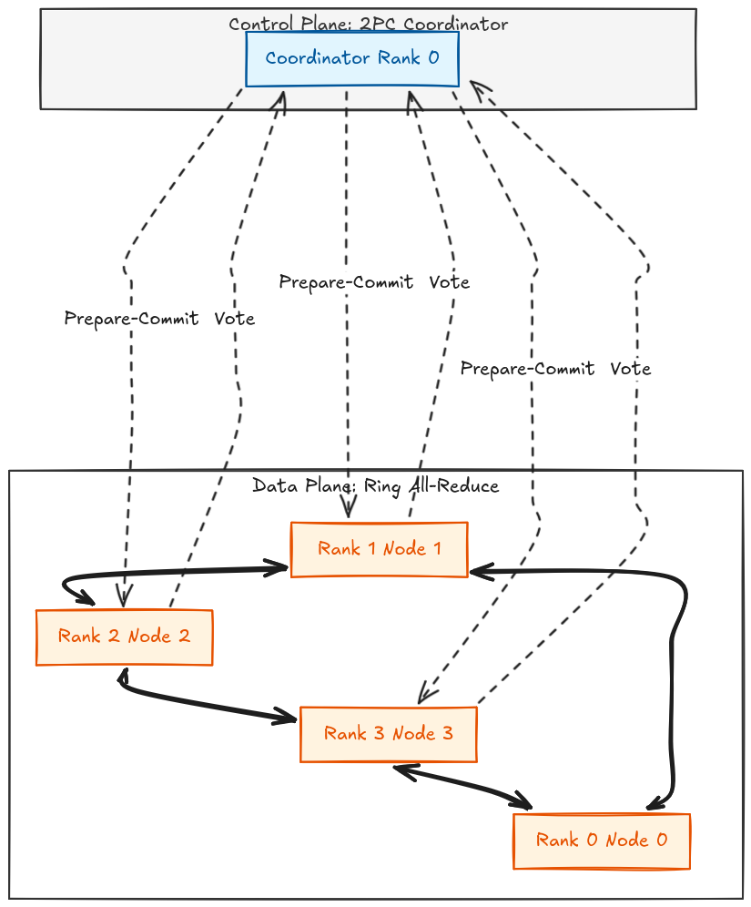
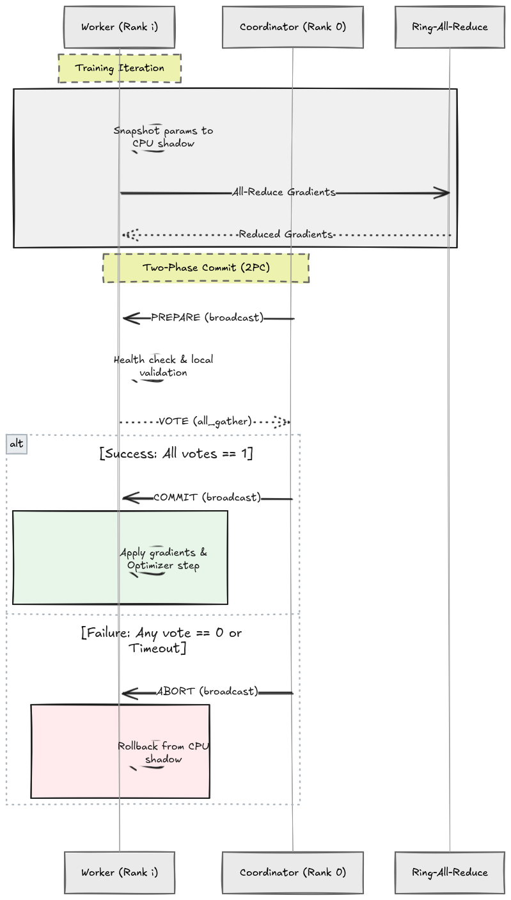
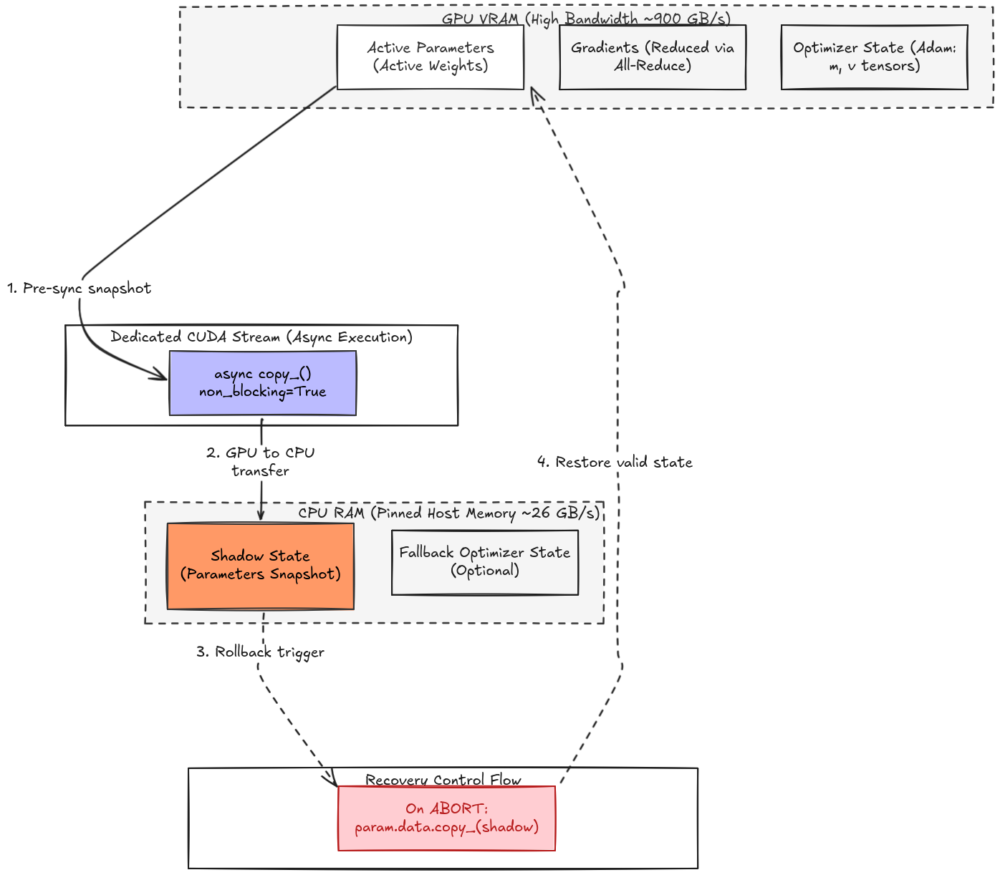
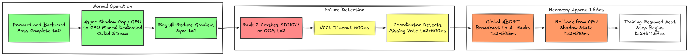

# MTGS: Micro-Transactional Gradient Synchronization

[](https://www.python.org/downloads/)
[](https://pytorch.org/)
[](LICENSE)

MTGS is a fault-tolerance system for distributed Transformer fine-tuning that wraps PyTorch DDP gradient synchronization in a lightweight two-phase commit (2PC) protocol. When a GPU node fails during distributed training, MTGS detects the failure, rolls back model state from CPU-pinned memory, and resumes training in **< 2 milliseconds** — orders of magnitude faster than traditional disk checkpoint-restart (minutes).

## Key Results

| Metric | Baseline (BSP) | MTGS | Improvement |
|---|---|---|---|
| Recovery time (ETTR) | Minutes (disk I/O) | **1.67 ms** | ~180,000× faster |
| Throughput (no fault) | 21,906 tok/s | 23,180 tok/s | **+5.8%** |
| Throughput (with abort) | Crashes | 18,637 tok/s | Survives faults |
| Control overhead | — | O(N) messages | Independent of model size |
| Recovery granularity | Job-level restart | Per-micro-batch | 10,000× finer |

## Problem

Distributed training of large language models relies on Bulk Synchronous Parallel (BSP) with Ring-All-Reduce gradient synchronization. A single node failure — caused by spot instance preemption, OOM, or network timeout — crashes the entire job. Standard recovery requires reloading a disk checkpoint, costing **minutes of wasted GPU compute**. On spot/preemptible clusters where failures occur every 2–10 minutes, this makes distributed training economically impractical.

## How It Works

### Architecture



MTGS adds a transactional layer between gradient synchronization and the optimizer step. The core insight: since gradient synchronization is already a synchronization barrier, we can piggyback a lightweight consensus protocol on it with minimal overhead.

### Two-Phase Commit Protocol



Each training step follows this transaction flow:

1. **Shadow** — Before gradient sync, snapshot model parameters from GPU VRAM to CPU pinned memory on a dedicated CUDA stream
2. **Sync** — Execute the standard Ring-All-Reduce gradient synchronization
3. **Prepare** — Coordinator (Rank 0) broadcasts a prepare signal
4. **Vote** — Each rank runs a local health check (gradients finite, memory OK), then `all_gather` votes across all ranks
5. **Commit/Abort** — If all votes are healthy, apply gradients and advance. Otherwise, restore parameters from CPU shadow and retry the batch

### Memory Hierarchy



### Failure Recovery



## Implementation

The system is implemented as a PyTorch `register_comm_hook` that intercepts gradient bucket synchronization:

- **`mtgs/hooks/comm_hook.py`** — DDP communication hook that wraps each all-reduce in a 2PC transaction. Registered via `model.register_comm_hook(state, mtgs_comm_hook)`
- **`mtgs/hooks/transaction.py`** — 2PC protocol: prepare broadcast, `all_gather` vote collection, commit/abort broadcast. O(N) message complexity, independent of model size
- **`mtgs/shadow/copy_stream.py`** — Async GPU→CPU copy on a dedicated CUDA stream, overlapping with forward/backward computation
- **`mtgs/shadow/rollback.py`** — CPU→GPU state restoration on abort, including optimizer and scheduler state
- **`mtgs/fault/injector.py`** — Configurable SIGKILL injection daemon for fault testing with safety guards and dry-run mode
- **`mtgs/profiling/ettr_timer.py`** — Nanosecond-precision recovery time measurement with CSV export

Every component has a toggle flag (`--mtgs-disable-hook`, `--mtgs-disable-shadow`, `--mtgs-disable-2pc`) for ablation studies.

## Quickstart

```bash
# Clone and install
git clone https://github.com/salarkhannn/MTGS.git
cd MTGS
pip install -e .

# Baseline training (no fault tolerance)
python -m mtgs.trainer --mode baseline --steps 5

# MTGS training with forced abort at step 2
python -m mtgs.trainer --mode mtgs --steps 5 --mtgs-force-abort-step 2
```

## Results

Local smoke tests on DistilBERT (66M params, 4 processes):

| Run | Mode | Fault | Mean tok/s | ETTR median | Throughput Δ |
|---|---|---|---|---|---|
| Baseline | BSP | None | 21,906 | — | 0% (ref) |
| MTGS | MTGS | None | 23,180 | — | +5.8% |
| MTGS | MTGS | Forced abort | 18,637 | **1.67 ms** | -14.9% |

The 1.67 ms ETTR is dramatically below the 1-second target. The throughput improvement in the no-fault case is attributed to the async shadow copy stream acting as a CUDA warmup. Under faults, MTGS recovers in < 2 ms while baseline training permanently crashes.

## Formal Properties

- **Consistency:** Step-level atomicity — for every training step, either all surviving ranks commit the same updated state or all roll back to the same previous state. No partial gradient application on any abort path.
- **Complexity:** Control plane is O(N) in rank count, independent of model parameter count. Baseline gradient sync is O(P) in parameters.
- **Failure model:** Fail-stop consistency (not Byzantine). Node crashes, SIGKILL, OOM, and NCCL timeouts are all handled.

## Project Structure

```
MTGS/
├── mtgs/                          # Core package
│   ├── trainer.py                 # Distributed training entrypoint
│   ├── baseline.py                # Vanilla BSP DDP baseline
│   ├── config.py                  # Dataclass configuration
│   ├── dataloader.py              # Distributed sampler + shard validation
│   ├── hooks/
│   │   ├── comm_hook.py           # ★ Gradient sync interception
│   │   └── transaction.py         # ★ 2PC protocol implementation
│   ├── shadow/
│   │   ├── allocator.py           # Pinned CPU tensor allocation
│   │   ├── copy_stream.py         # Async CUDA stream shadow copies
│   │   └── rollback.py            # State restoration on abort
│   ├── fault/
│   │   ├── injector.py            # SIGKILL injection daemon
│   │   └── detector.py            # Failure detection
│   ├── profiling/
│   │   ├── ettr_timer.py          # Recovery time measurement
│   │   ├── throughput.py          # Tokens/sec logging
│   │   └── tracer.py              # Structured trace events
│   └── utils/
│       ├── logging.py             # JSONL structured logger
│       └── distributed.py         # Rank/world size helpers
├── scripts/                       # Experiment automation
├── tests/                         # 15 test suites (~483 LOC)
├── experiments/                   # Configs, results, analysis
├── docs/                          # Design doc, diagrams, results
└── pyproject.toml
```

## Tests

```
pytest tests/ -v
```

## License

MIT
