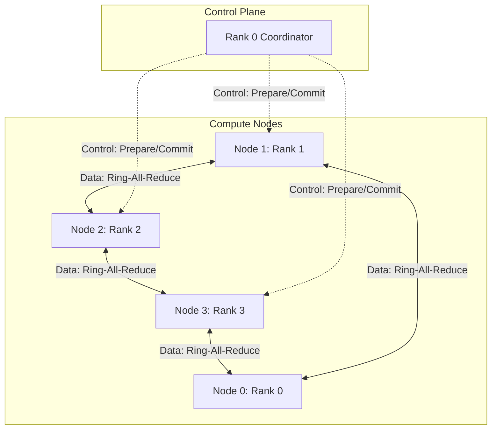
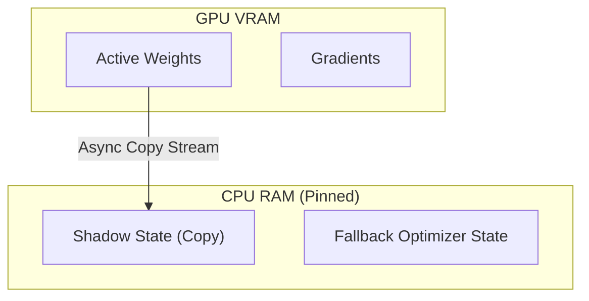
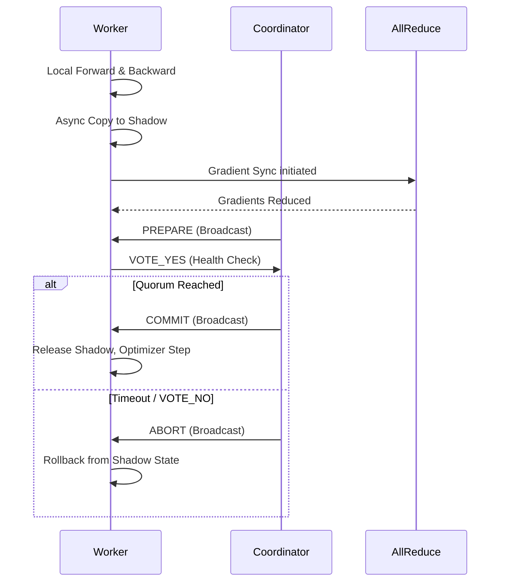
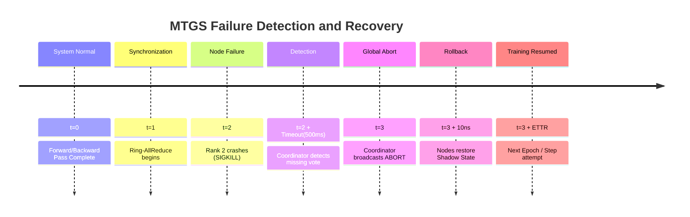

# MTGS: Full System Design Document

## 1. Scope Lock and Traceability

### 1.1 Problem Statement
In large-scale language model fine-tuning (e.g., using a 4-node GPU cluster with parameter-heavy transformers like DistilBERT), node failures cause standard Ring-All-Reduce distributed data parallel (DDP) implementations to hang or crash. Traditional checkpoint-and-restart methodologies are disk I/O bound, resulting in unacceptable Mean Time to Recovery (MTTR) spanning minutes or hours.

### 1.2 Hypothesis Targets
Implementing Micro-Transactional Gradient Synchronization (MTGS) via in-memory two-phase commit (2PC) and CPU-pinned shadow states will achieve:
- **Sub-second Expected Time to Recovery (ETTR):** < 1.0 second.
- **Micro-overhead Communication:** < 5% system throughput degradation compared to ideal baseline.

### 1.3 Baseline Related Work
Existing methods (TorchFT, Oobleck, DeepSpeed auto-resume) primarily depend on asynchronous disk checkpoints or process group rebuilds, facing multi-second or minute-long overheads. MTGS acts intrinsically at the batch/micro-batch synchronization boundary.

### 1.4 Traceability Matrix
| D1 Requirement         | D2 Section                | Validation     |
|------------------------|---------------------------|----------------|
| In-memory Rollback     | 3. Memory Hierarchy       | `< 5% RAM use` |
| 2PC Control Channel    | 4. Communication Model    | Msg Complexity |
| Fault Tolerant Sync    | 7. Failure Model          | Detect & Abort |

### 1.5 Assumptions List
- **Hardware:** 4× T4 GPU nodes (cloud instances), homogeneous interconnect.
- **Network:** Symmetric TCP/IP latency, non-partitioned complete graph.
- **Framework:** PyTorch 2.x, NCCL backend with `NCCL_ASYNC_ERROR_HANDLING=1`.

### 1.6 Non-Goals
- Byzantine fault tolerance (BFT). We assume fail-stop crashes only.
- Long-term permanent storage of checkpoints.

---

## 2. System Architecture

### 2.1 Cluster Topology
The cluster consists of 4 cloud instances, each with 1× NVIDIA T4 GPU, and >=16GB of CPU RAM. Ranks are mapped globally from Rank 0 (coordinator) to Rank 3.

### 2.2 Control Flow Channels
- Prepare: Invoked upon successful local forward/backward pass.
- Vote: Health check broadcast to Coordinator.
- Commit/Abort: Decided globally to alter the micro-batch state.

---

## 3. Memory Hierarchy Design

### 3.1 State Categories and Layout
1. **Active Params (VRAM):** Directly consumed by the model.
2. **Gradients (VRAM):** Accumulated per batch.
3. **Optimizer State (VRAM/RAM):** Adam moments.
4. **Shadow State (CPU Pinned RAM):** Clean parameters snapshot prior to gradient update.

### 3.2 Expected RAM Amplification Factor
Due to the shadow state holding precisely the identical parameters as VRAM, the amplification factor locally is strictly `+1x 모델 Params`. We recommend a safety limit of pinning no more than 80% of node RAM.

---

## 4. Communication Model

### 4.1 Sequence Diagram

### 4.2 Messages Schema
- **Prepare:** INT8 `[1]`
- **Vote:** INT8 `[1]` (0 = block, 1 = healthy)
- **Commit/Abort:** INT8 `[1]`

---

## 5. Payload Complexity Analysis

### 5.1 Formal Equations
Let $P$ be the number of trainable parameters.
Let $B_p$ be the bytes per parameter ($B_{fp32}=4$, $B_{fp16}=2$).
- **Baseline Payload:** $L_{base} = P \times B_p$
- **MTGS Control Payload:** $L_{ctrl} = O(N)$ where $N$ is the number of ranks, as control messages are independent of parameter count $P$.

Because $L_{ctrl} \ll L_{base}$, MTGS control plane has $O(1)$ complexity relative to the model size, achieving complexity class equivalence.

---

## 6. Consistency Model

### 6.1 Formal Proof Sketch
- **Invariants:** 
  For a step $t$, the post-commit view $V_{t+1}$ on all nodes $i, j$ MUST be identical ($V_{t+1}^i = V_{t+1}^j$).
- **Abort Path (No partial application):** 
  If node $k$ dies mid-All-Reduce, the vote quorum fails. Because $V_t$ is preserved in Pinned CPU RAM (Shadow), the abort protocol strictly restores $V_t$.
- **Commit Path:**
  Only permitted if ALL nodes survived the All-Reduce ring synchronization and voted.

---

## 7. Failure Model

### 7.1 Distributed Timeline Model

---

## 8. Performance Modeling

### 8.1 Speedup Laws
**Amdahl's Law:** 
$$ Speedup_{Amdahl} = \frac{1}{(S + \frac{1-S}{N})} $$
Where $S$ is the serial fraction representing MTGS control channel overhead.

**Gustafson's Law:** 
$$ Speedup_{Gustafson} = N - S(N-1) $$

---

## 9. Scalability Assumptions

### 9.1 Scaling Characteristics
- **Network Pipeline limits:** As node count increases, probability of failure scales $P(f|N) \approx 1 - (1-p)^N$.
- **Memory Scaling Formula:** $RAM_{node} = (Base\_Params \times Bytes\_Per\_Param \times 2_{Adam}) + Shadow\_Param\_Bytes$.

---

## 10. Implementation Plan & Milestones

1. **Milestone 1:** Baseline DistilBERT training hook bypass.
2. **Milestone 2:** CPU pinned tensor memory allocator hooks.
3. **Milestone 3:** `dist.all_gather` bounded 2PC vote implementation.
4. **Milestone 4:** Fault injector daemon utilizing `os.kill`.

---

## 11. Risk Analysis

| Risk | Probability | Impact | Mitigation Strategy |
|------|-------------|--------|---------------------|
| NCCL Timout Loop | High | High | `NCCL_ASYNC_ERROR_HANDLING` and localized heartbeat monitoring. |
| Memory OOM | Medium | High | FP16/BF16 shadow state truncation, memory guards in CPU allocation. |
| High Interconnect Noise | Low | Medium | Tune the timeout margin in 2PC. |

---

## 12. Academic Integrity & Citation
- All algorithms and derivations must properly credit existing literature regarding PyTorch DDP internals, 2PC protocols (e.g., standard Jim Gray distributed transactions), and Amdahl's Law derivatives. Uncited code snippets from `huggingface/transformers` are explicitly marked via inline headers or comments.
